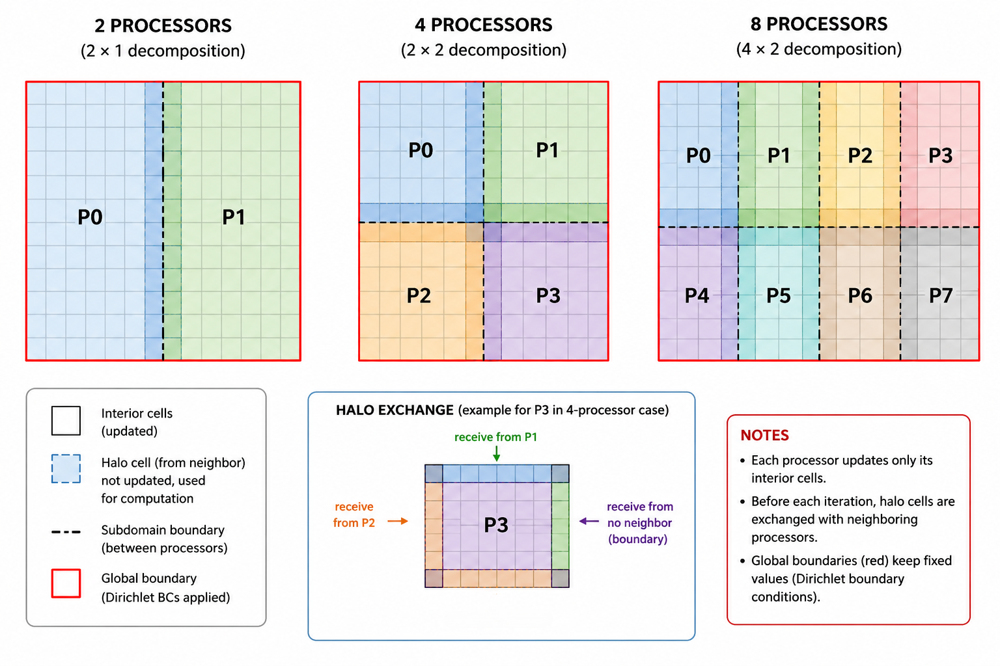
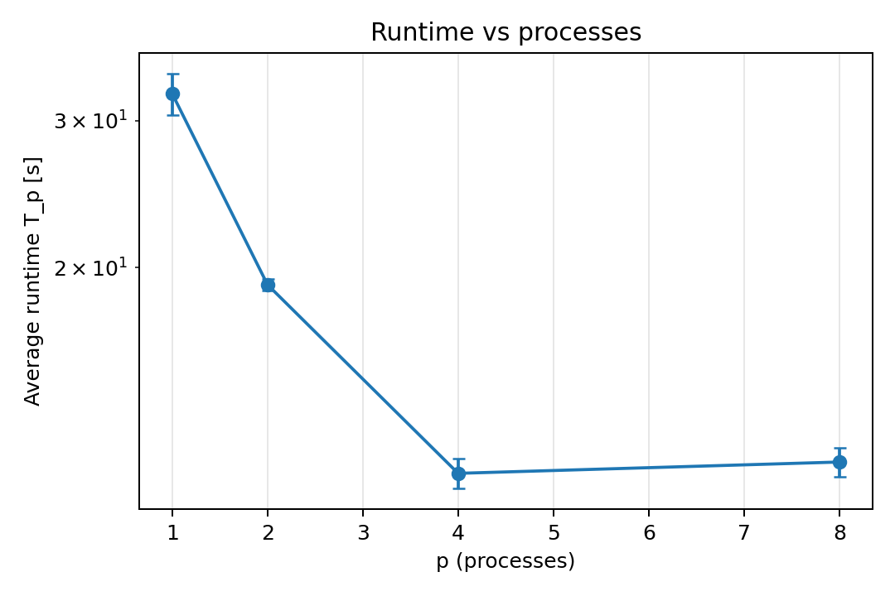
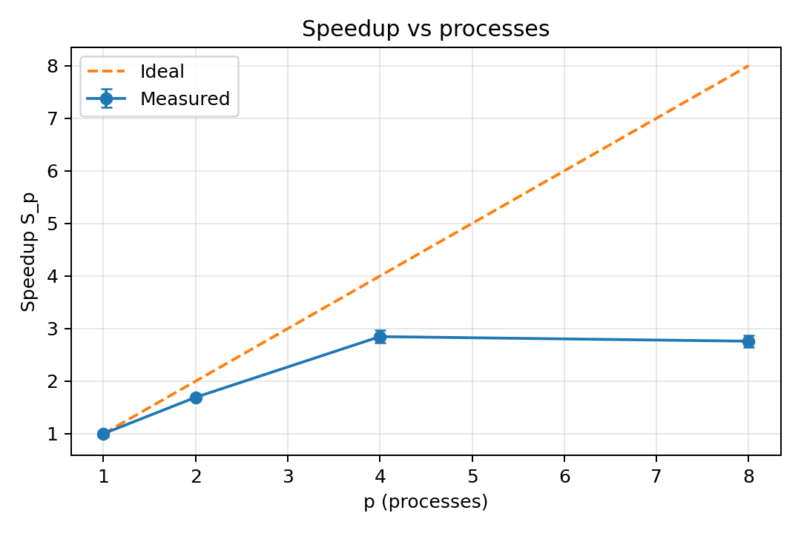
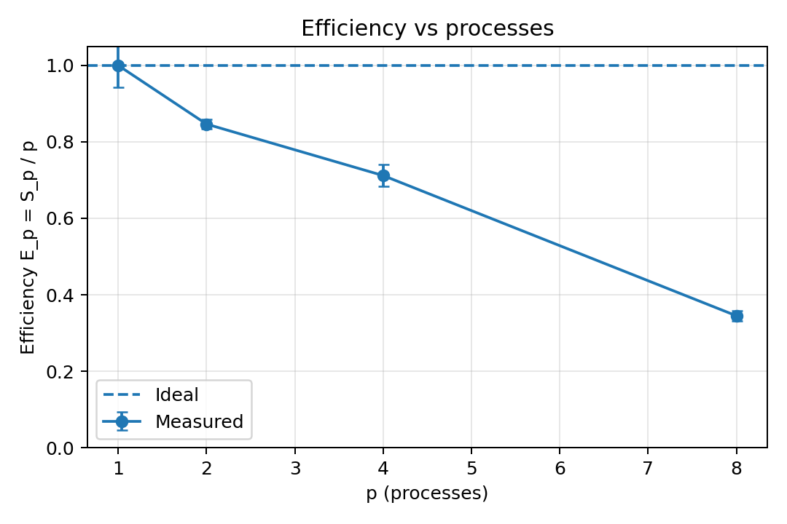
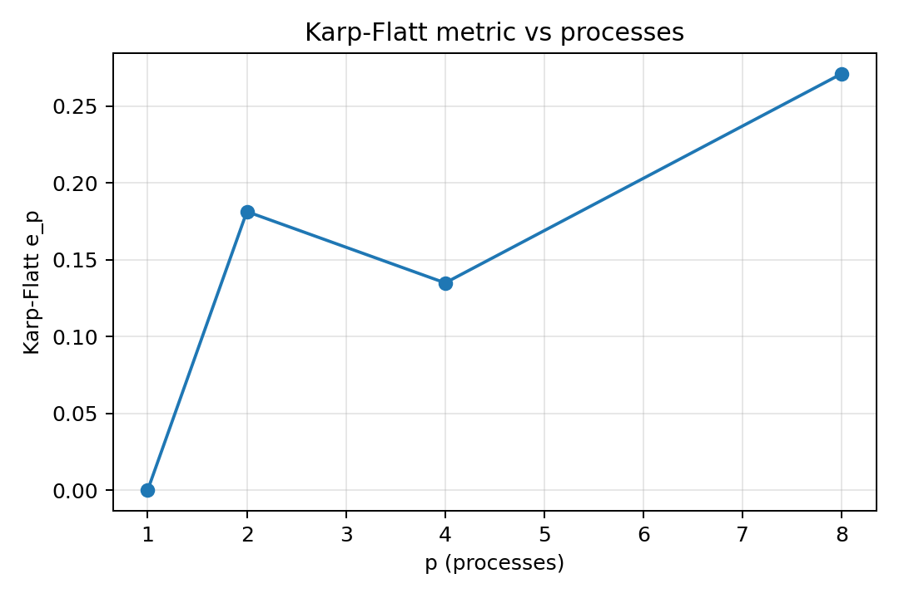
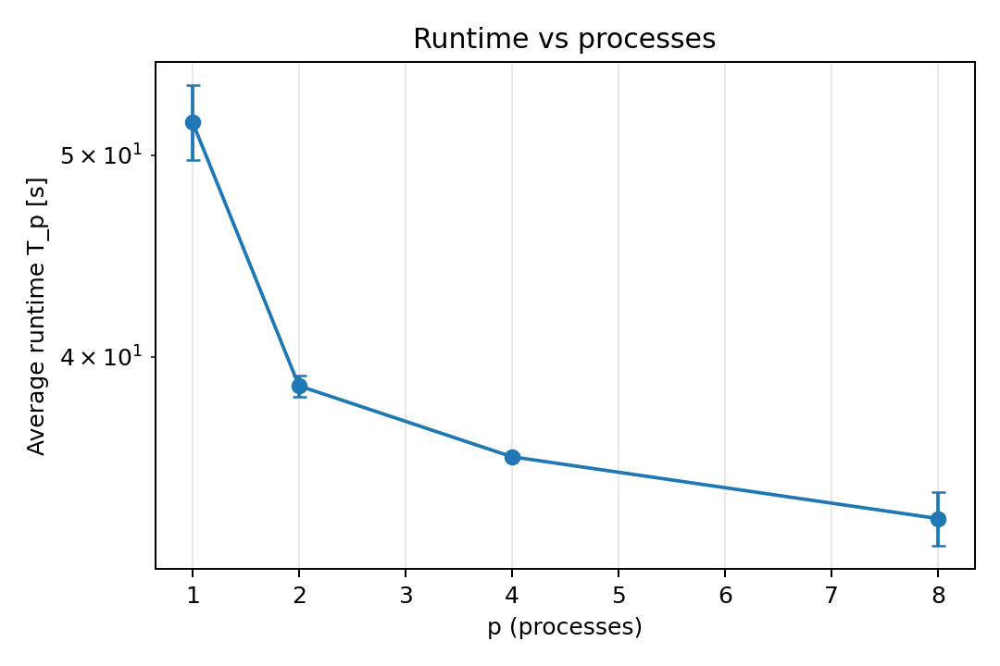
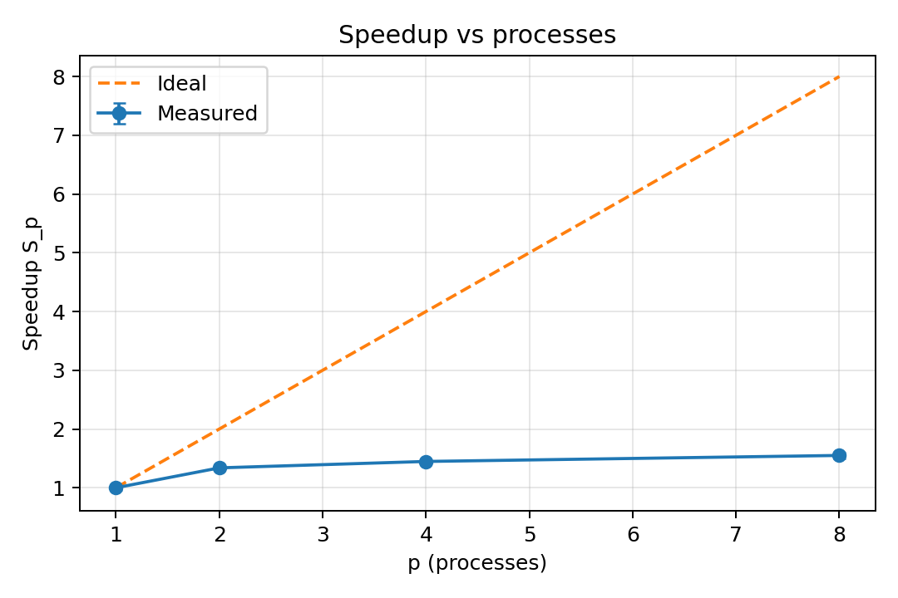
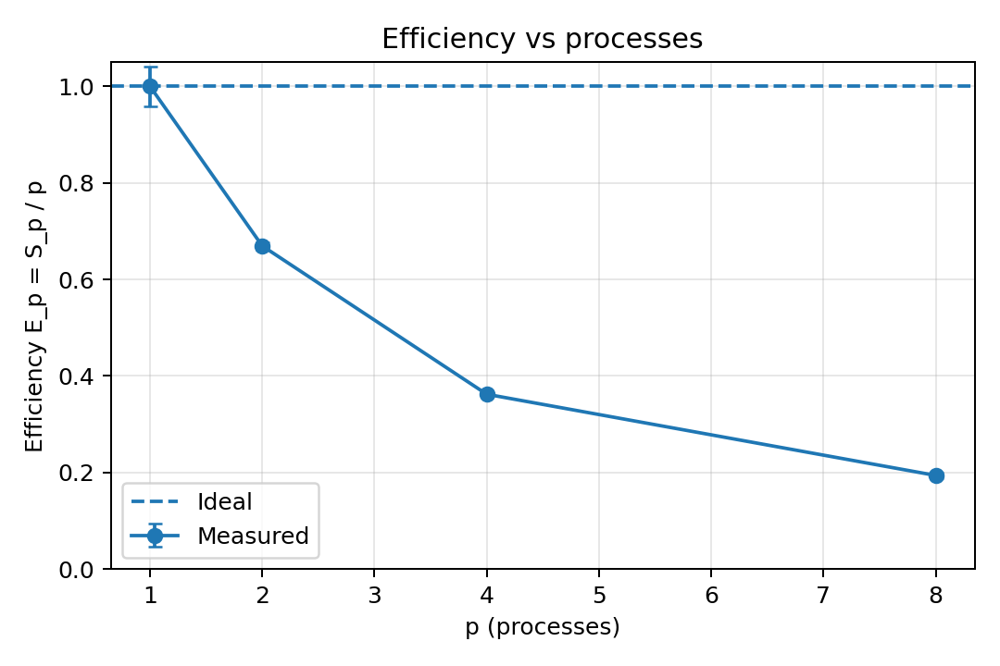
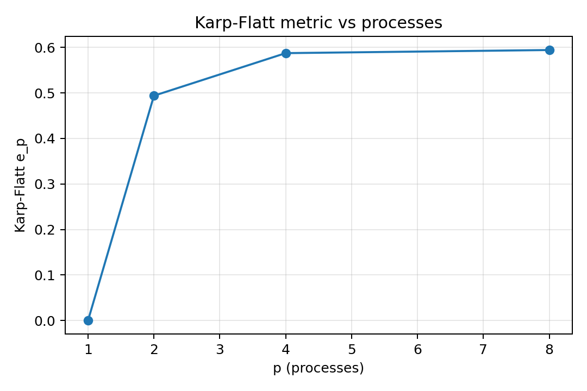

# 2D difuzija toplote z MPI

Repozitorij vsebuje kodo za računanje 2D difuzije toplote paralelizirano z MPI (2D domenska dekompozicija), ter:

- skripto za benchmark, ki ustvari CSV s časi izvajanja
- skripto za analizo, ki izpiše Markdown tabelo in shrani grafe
- ločeno demo skripto, ki ustvari GIF animacijo heat matrike

## Opis naloge

**Cilj:** Implementacija 2D domenske dekompozicije in izmenjava robov v dveh dimenzijah.

**Navodila:** Rešite difuzijsko enačbo na kvadratni mreži, kjer je nova temperatura točke `(i,j)` povprečje njenih štirih sosedov. Mrežo razdelite na manjše kvadrate (podmreže / *sub-grids*) med procese.

**MPI naloga:** Vsak proces mora v vsakem časovnem koraku izmenjati robne vrstice in stolpce s štirimi sosedi (zgoraj, spodaj, levo, desno).



## Struktura projekta

```
heat-diffusion-fdm-mpi/
  assets/
    grids.png               # shema dekompozicije + halo izmenjave
  requirements.txt
  results/
    raw_times.csv            # ustvari scripts/bench.sh
    summary.md               # ustvari scripts/analyze.py
    runtime_vs_p.png         # ustvari scripts/analyze.py (opcijsko)
    speedup_vs_p.png         # ustvari scripts/analyze.py (opcijsko)
    efficiency_vs_p.png      # ustvari scripts/analyze.py (opcijsko)
    karp_flatt_vs_p.png      # ustvari scripts/analyze.py (opcijsko)
    heat_*.gif               # ustvari scripts/demo_animation.py
  scripts/
    heat2d_mpi.py            # MPI reševalnik
    bench.sh                 # benchmark -> results/raw_times.csv
    analyze.py               # analiza + grafi
    demo_animation.py        # MPI demo -> GIF animacija
```

## Okolje

Okolje, v katerem so bile izvedene meritve:

- OS: Windows + WSL (Ubuntu)
- CPU: Intel Core i7-12700H (14 jeder / 20 niti)
- Število MPI procesov: `p = 1, 2, 4, 8`
- Ponovitve: 3 zagoni za vsak `p`
- Mreža: `N = 512` (globalna mreža je `N x N`)
- Iteracije: `iters = 20000`
- Robni pogoji (Dirichlet): `TOP=100, LEFT=0, BOTTOM=0, RIGHT=0`

Opomba: mogoče je poganjati tudi več procesov (npr. 16) z uporabo strojnih niti (SMT)

## Namestitev

### 1) Sistemske zahteve (WSL)

V WSL Ubuntu potrebujete Python 3 in MPI okolje (OpenMPI ali MPICH). Primer za OpenMPI:

```bash
sudo apt update
sudo apt install -y python3 python3-pip openmpi-bin libopenmpi-dev
```

### 2) Python paketi

Iz roota repozitorija:

```bash
python3 -m pip install -r requirements.txt
```

## Zagon

Iz WSL (root repozitorija):

```bash
mpirun -np 4 python3 scripts/heat2d_mpi.py --N 512 --iters 20000 --bc 100 0 0 0
```

Izpiše se ena vrstica povzetka (iz rank 0), ki vsebuje skupni čas, število iteracij in dimenzije MPI mreže.

## Benchmark

Skripta za benchmark zapiše CSV s tremi zagoni za vsak `p`.

Iz WSL:

```bash
bash scripts/bench.sh --N 512 --iters 20000 --bc 100 0 0 0 --maxp 8 --csv results/raw_times.csv
```

Kaj naredi:

- Zažene `p = 1, 2, 4, 8` (potence 2 do `--maxp`)
- Vsak `p` zažene natanko 3-krat
- Zapiše/prepiše `results/raw_times.csv`

## Analiza (tabela + grafi)

### Ustvari Markdown povzetek

```bash
python3 scripts/analyze.py --in results/raw_times.csv --out results/summary.md
```

### Ustvari grafe skaliranja (PNG)

```bash
python3 scripts/analyze.py --in results/raw_times.csv --plot all --plot-dir results --plot-format png
```

Ustvari:

- `results/summary.md` (tabela z `Sₚ`, `Eₚ` in Karp-Flatt `e_p`)
- `results/runtime_vs_p.png` (čas na logaritemski osi)
- `results/speedup_vs_p.png` (vsebuje idealno referenčno premico `S=p`)
- `results/efficiency_vs_p.png`
- `results/karp_flatt_vs_p.png`

## Interpretacija rezultatov

Izvedli smo meritve **strong scalinga** (fiksna velikost problema) za MPI 2D difuzijo toplote. Osnovni eksperiment je uporabil grid `N=512` in `20000` iteracij, meritve pa so bile izvedene za `p ∈ {1,2,4,8}`. Vsaka konfiguracija je bila zagnana trikrat, pri interpretaciji pa uporabljamo povprečne čase izvajanja.

Uporabljene metrike:

- pospešek: `Sₚ = T₁ / Tₚ`
- učinkovitost: `Eₚ = Sₚ / p`
- Karp-Flattova metrika:
`eₚ = (1/Sₚ - 1/p)/(1 - 1/p)`

### Osnovni strong-scaling rezultat (`512×512`, `20000` iteracij)

| p | avg Tₚ [s] | Sₚ | Eₚ | Karp-Flatt eₚ |
|---:|---:|---:|---:|---:|
|1|32.289|1.000|1.000|0.000|
|2|19.073|1.693|0.846|0.181|
|4|11.340|2.847|0.712|0.135|
|8|11.699|2.760|0.345|0.271|

Rezultati kažejo dobro skaliranje do `p=4`.

Pri prehodu:

- `1 → 2` procesov se čas zmanjša za približno **41 %**
- `2 → 4` procesov za dodatnih **40 %**
- `4 → 8` procesov pa izboljšanja praktično ni

Pri `p=8` se čas celo rahlo poveča (`11.34 s → 11.70 s`), zato dodatni procesi ne prinesejo več koristi.

### Runtime graf



Graf jasno pokaže hitro zmanjševanje časa do `p=4`, nato pa skoraj popolno stagnacijo.

### Speedup graf



Idealna referenčna premica (`S=p`) predstavlja popolnoma linearno skaliranje. Dejanski rezultati ji sledijo pri manjšem številu procesov, nato pa začnejo odstopati.

Pri `p=8` dosežemo:

- `S₈ ≈ 2.76`
- idealno bi bilo `S₈ = 8`

Razlika pomeni, da dodatni procesi ne prispevajo sorazmerno več računske moči.

### Efficiency graf



Učinkovitost pada z večanjem števila procesov:

- `E₂ ≈ 0.85`
- `E₄ ≈ 0.71`
- `E₈ ≈ 0.35`

To pomeni, da pri `p=8` vsak proces prispeva bistveno manj koristnega dela kot pri manjšem številu procesov.

### Karp-Flatt graf


Karp-Flattova metrika ocenjuje vpliv ne-paralelizabilnega dela in paralelnih overhead stroškov.

Vrednosti:

- `e₂ ≈ 0.18`
- `e₄ ≈ 0.13`
- `e₈ ≈ 0.27`

Pri `p=8` se vrednost skoraj podvoji, kar kaže na opazno povečanje komunikacijskih in sinhronizacijskih stroškov.

---

## Analiza vzroka slabega skaliranja

Po začetnih rezultatih (`512×512`, `20000` iteracij) se je skaliranje ustavilo pri `p=8`. Ker je obstajal sum, da je problem posledica premajhne mreže in velikega števila iteracij, smo izvedli dodatne meritve z večjimi mrežami in manjšim številom časovnih korakov.

### Dodatni eksperimenti

| Konfiguracija | p=1 [s] | p=2 [s] | p=4 [s] | p=8 [s] | S₈ |
|---|---:|---:|---:|---:|---:|
| `512×512`, `20000` | 32.29 | 19.07 | 11.34 | 11.70 | 2.76 |
| `1024×1024`, `5000` | 33.22 | 21.18 | 15.13 | 15.02 | 2.21 |
| `2048×2048`, `5000` | 214.30 | 160.12 | 138.61 | 130.92 | 1.64 |
| `2048×2048`, `1250` | 51.87 | 38.75 | 35.83 | 33.46 | 1.55 |

Grid 2048 x 1025 iteracij:
| | |
|---:|:---|
|  |  |
|  |  |

Če bi bil glavni problem premajhna mreža, bi pričakovali izboljšanje skaliranja pri večjih problemih. Tega ne opazimo.

Nasprotno, pri večjih mrežah se pospešek celo nekoliko zmanjša.

To kaže, da začetni rezultat pri `512×512` ni bil zgolj posledica premajhne velikosti problema.

### Razčlenitev časa izvajanja

Za konfiguracijo `2048×2048`, `1250` iteracij smo dodatno merili:

- `T_total`
- `T_halo`
- `T_stencil`

Povprečne vrednosti:

| p | T_total [s] | T_halo [s] | T_stencil [s] |
|---:|---:|---:|---:|
|1|51.87|0.10|40.94|
|2|38.75|0.59|33.67|
|4|35.83|1.69|31.09|
|8|33.66|6.03|26.19|

Rezultati pokažejo, da se računski del pravilno paralelizira:

- `T_stencil` se zmanjša iz `40.94 s` na `26.19 s`

Komunikacijski del pa se povečuje:

- `T_halo` naraste iz `0.10 s` na `6.03 s`

Vendar komunikacija pri `p=8` predstavlja približno:

`6.03 / 33.66 ≈ 18%`

skupnega časa izvajanja.

To pomeni, da komunikacija sicer prispeva k dodatnim stroškom, vendar sama po sebi ne pojasni slabega skaliranja.

### Sklep

Dodatni eksperimenti kažejo, da slabo skaliranje ni posledica zgolj premajhne mreže. Računski del se pravilno paralelizira, vendar pridobljeni čas postopoma zmanjšujejo drugi stroški izvajanja. Komunikacija prispeva del tega učinka, vendar po izmerjenih vrednostih ni glavni omejitveni dejavnik.

## Demo animacija (GIF)

`scripts/demo_animation.py` je samostojen MPI demo, ki ustvari GIF v `results/`.

### Primer 1: zgornji rob topel (vrednost 100), ostali robovi hladni, začetno stanje vseh notranjih celic je 0

```bash
mpirun -np 2 python3 scripts/demo_animation.py \
  --N 64 \
  --iters 200 \
  --init zero \
  --bc 100 0 0 0 \
  --fps 20 \
  --frame-step 1
```

### Primer 2: naključno začetno stanje notranjih celic, vsi robovi 0

```bash
mpirun -np 2 python3 scripts/demo_animation.py \
  --N 64 \
  --iters 200 \
  --init random \
  --bc 0 0 0 0 \
  --fps 20 \
  --frame-step 2
```

## Zagon iz Windowsa

```powershell
wsl -d Ubuntu -- bash -lc "cd /mnt/c/Users/Irina/Documents/2.2/VisokoZmogljivoRacunalnistvo/heat-diffusion-fdm-mpi && bash scripts/bench.sh --N 512 --iters 20000 --bc 100 0 0 0 --maxp 8 --csv results/raw_times.csv"
```

```powershell
wsl -d Ubuntu -- bash -lc "cd /mnt/c/Users/Irina/Documents/2.2/VisokoZmogljivoRacunalnistvo/heat-diffusion-fdm-mpi && python3 scripts/analyze.py --in results/raw_times.csv --out results/summary.md --plot all --plot-dir results --plot-format png"
```

